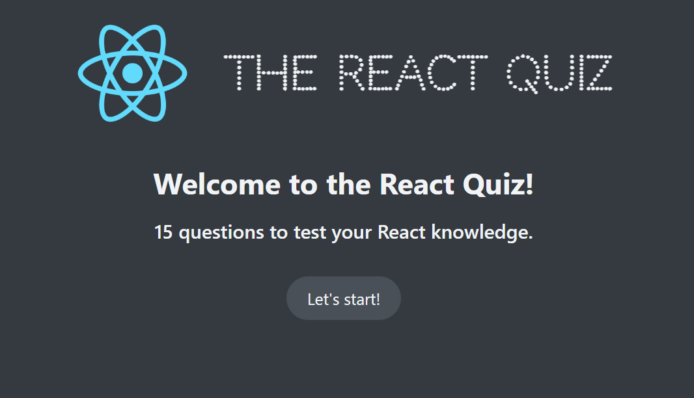
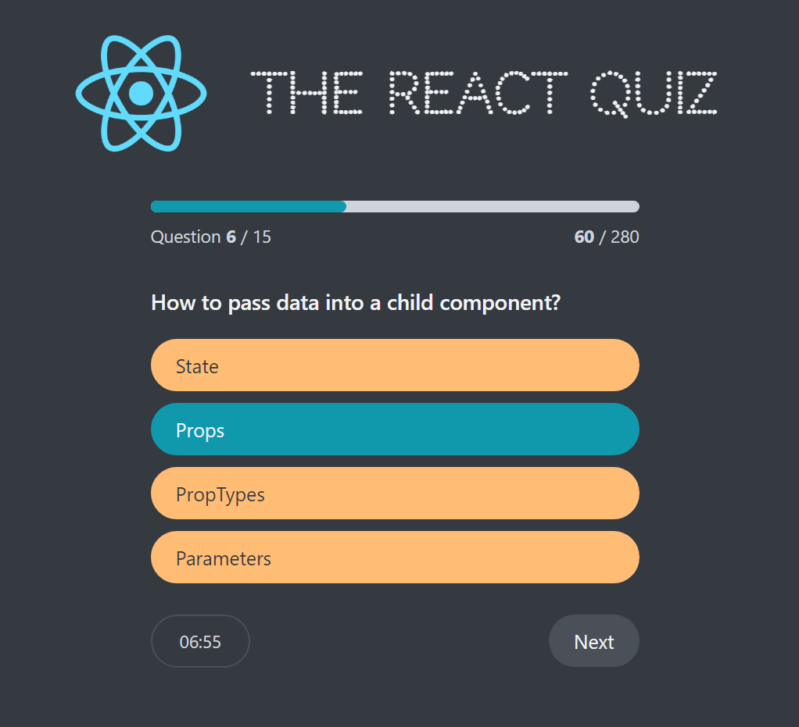
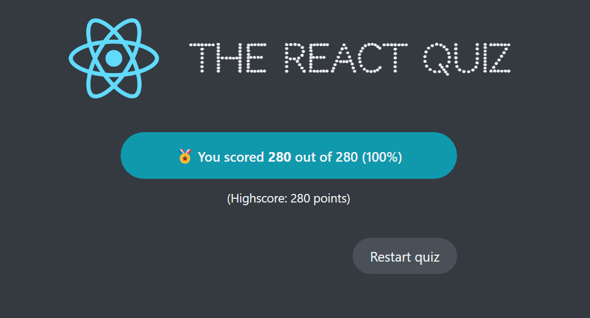

# The React Quiz ❔

**Developer: Aleksandra Haniok**

💻 [Visit live website](https://the-react-quiz-ah.netlify.app)

## About

This project is a simple knowledge test about React JavaScript library which was build with React.
The purpose of this project was to learn the useReducer hook. There's no external API fetching, all the questions are included inside this app.

## Run it locally

### `npm start`

Runs the app in the development mode.\
Open [http://localhost:3000](http://localhost:3000) to view it in your browser.

The page will reload when you make changes.\
You may also see any lint errors in the console.

### `npm run server`

Runs the JSON Server on PORT :8000 with Endpoint http://localhost:8000/questions

### `npm test`

Launches the test runner in the interactive watch mode.\
See the section about [running tests](https://facebook.github.io/create-react-app/docs/running-tests) for more information.

### `npm run build`

Builds the app for production to the `build` folder.\
It correctly bundles React in production mode and optimizes the build for the best performance.

The build is minified and the filenames include the hashes.\
Your app is ready to be deployed!

See the section about [deployment](https://facebook.github.io/create-react-app/docs/deployment) for more information.

### Learning

- Use of useReducer hook

## Acknowledgments

- The project was build as part of this [React course](https://www.udemy.com/course/the-ultimate-react-course/) with Jonas Schmedtmann.
